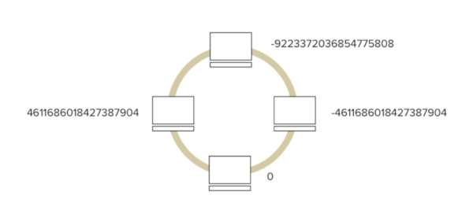

# Getting Started with Cassandra - Sep.2020 

- Udemy
- Instrutora: @ruthstryker
- Anotações feitas ao longo do treinamento

## Cassandra - Distributed Database 

- cassandra.apache.org
- Open Source
- A NoSQL database technology
- Distributed Database
- BigData Tecnology
- Based on "Amazon Dynamo" and "Google BigTable"

- ver casos de uso em: planetcassandra.org

## System Requirements

* 64 bit Operational System (Mac, Windows, Linux) [ 
```$ getconf LONG_BIT```]
* 8GB RAM (or more) [```$ top```]
* 30GB of free HD (or more) [```$ df -h```]
* VMWare Player (testarei com Docker)

## Cassandra is a distributed database

ver: Cassandra Architecture | www.datastax.com/docs


## Snitch

(dedo-duro, delatar, denunciar)

Não há um "master node"

**PropertyFileSnitch** (uma cópia do mesmo arquivo em cada node)

Exemplo:
```
IP name...
IP name...
```

É o que informa aos demais nodes quais são os nodes participantes do cluster.

## Gossip

(fofoca, bisbilhotice, ...)

É como um node faz para se comunicar com outro em um cluster (a cada segundo). Comunicação interna - entre nodes.

Para comunicação externa (app -> Cassandra DB), são usados **CQL** ou **Thrift**.

## Data Distribution

Quem faz a distribuição das linhas pelos "nodes" é o **partitioner**, que é um algoritmo que determina para qual node uma determinada linha de dados será enviada.

Partitioner padrão: **MURMUR3**

**MURMUR3** : usa o valor da **1a coluna** para gerar um valor "único" entre -2^63 e 2^63

Cada node do cluster recebe a atribuição para um "range" de tokens (ou múltiplos ranges com virtual nodes).



De onde vêm esses números?

```
$ python -c 'print [str(((2**64 / 4 ) * i) -2**63) for i in range (4)]'
```
(*) Onde "4" é a quantidade de nodes.

Ou usar o Murmur3 Calculator (procurar no Google, pois há vários).


## Replication

**Replication Factor**: deve ser especificado assim que o DB for definido. Obviamente o valor mínimo é 1.

Especifica quantas *instâncias de dados* (do mesmo dado) devem haver em um DB.


## Virtual Nodes (vnodes)

É uma forma alternativa de atribuir ranges de tokens para os nodes (default do Cassandra).

Em vez de um node ser responsável por apenas *1 range de tokens*, passa a ser responsável por *vários tokens range menores* (por padrão, 256).

Ex.:
* 512 para computadores potentes
* 128 para computadores menos potentes

Facilita a adição de novos nodes em um cluster, enquanto mantém um cluster balanceado.


## Instalação

```
$ mkdir ~/cassandra
```

Descompactar o arquivo (tar -xvzf ...).

No arquivo de configuração ```./conf/cassandra.yaml```, modificar a propriedade *data_file_directories* 

