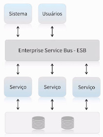
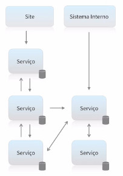
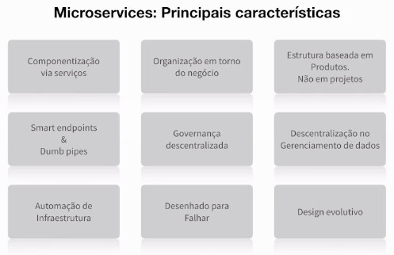
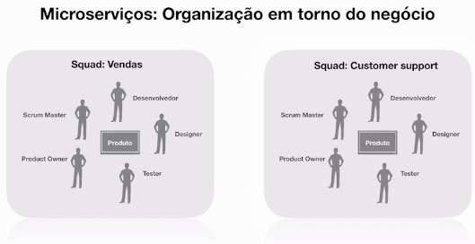
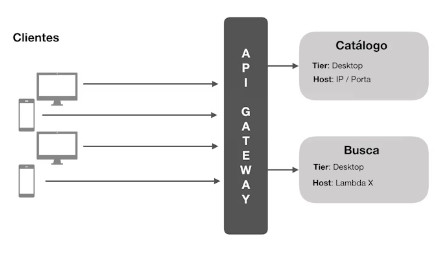
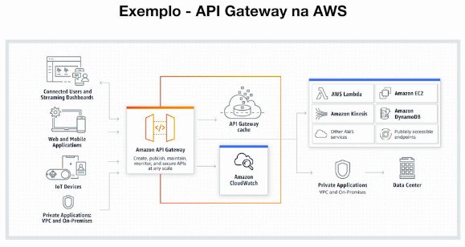
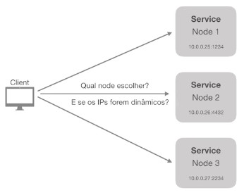
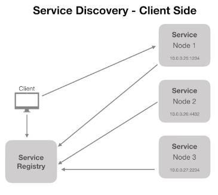
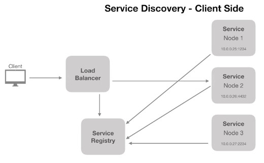

# Full Cycle Development

[Link de acesso ao treinamento](http://portal.code.education)

# Arquitetura de Software - Microsserviços
---

# 1. Introdução aos Microserviços

## O que é um serviço?
- Disponibiliza informação
- Realiza transações
- Resolve problemas de negócio
- Independente de tecnologia ou produto
- Pode estabelecer a comunicação com diversos "clientes" 
  - sistemas, pessoas, etc que se conectam a esse serviço

## SOA :: Arquitetura Orientada a Serviços

Integra diversos serviços através de um ESB

- Serviços normalmente maiores baseados em funcionalidades
- Necessidade de ESB
- Single point of failure 
  - Considerado a maior falha desse modelo. Se o ESB cair, tudo cai. Quanto mais decentralizado, menos se torna dependente de alguma coisa
- Compartilhamento de banco de dados é comum
- É comum ter sistemas monolíticos sendo utilizados como serviços.

\* Lembrando que SOA não é algo ruim, tudo tem a sua aplicação.

## Arquitetura baseada em Microserviços

- Serviços pequenos com poucas responsabilidades
- Maior tolerância a falhas
  - Se um serviço cai, não é todo o sistema que cai
- São totalmente independentes
  - Foi criado para resolver um problema, tem seu próprio BD, sua infra, autenticação, etc. 
  - É independente no processo de deploy, BD, etc
- Cada serviço possui seu próprio banco de dados
- Comunicação síncrona ou assíncrona
  - Na maioria das vezes com filas. 
  - O importante é não perder requisições/mensagens, mesmo que o serviço esteja fora do ar

## Microserviços não são adequados a todas as situações

- Arquitetura é mais complexa 
- Custo mais elevado (mais infra)
- Necessidade de mais equipes para manter (squads)
- Sistema precisa ser grande o suficiente para justificar o uso de ms
- Gera problemas que normalmente não ocorriam
- Monitoração complexa

> "Microsserviços não são moda, mas sim necessidade."

## Microservices: Principais características

- Componentização via serviços
- Organização em torno do negócio
- Estrutura baseada em Produtos. Não em projetos.
- Smart endpoints & Dumb pipes
- Governança descentralizada
- Descentralização no Gerenciamento de dados
- Automação de infraestrutura
- Desenhado para Falhar
- Design evolutivo.

[Microservices by Martin Fowler](https://martinfowler.com/articles/microservices.html)

# 2. Orientação a Negócios

Fonte: 

[Microservices by Martin Fowler](https://martinfowler.com/articles/microservices.html)

## Componentização via serviços

- Services dos microserviços != Services da O.O.
- "Componente é uma unidade de software independente que pode ser substituída ou atualizada"

### Desvantagens da Componentização

- Chamadas externas são mais custosas do que chamadas locais 
  - Custo de rede, hardware, configuração, banda, etc
- O cruzamento entre componentes pode se tornar complexo
  - Uso de filas, rollback de transações, etc.
- As transações entre serviços são "grandes desafios"
  - Todos os serviços envolvidos devem ter um mecanismo de inspeção e saber como resolver o rollback caso seja necessário
- Mudanças bruscas em regras de negócio podem afetar diversos serviços, tornando o processo difícil de ser refeito.

## Organização em torno do negócio

- Conceito importante
  - Um projeto é baseado em um ou mais produtos que trabalham em diferentes contextos
  - Não tomar a decisão da "quebra" dos microsserviços em um contexto técnico (ex.: autenticação, acl, etc.).
  - Cada microsserviço é um "produto" (não é "tequiniquês")
- Time de desenvolvedores por produto
- Muitas empresas tratam os times como "squads" 
  - vide Netflix
  - vide Spotify
- Cada squad é multidisciplinar
- Cada squad é responsável por um ou mais produtos
- Cada produto pode ter um ou mais serviços envolvidos

# 3. Outras Características

## Estrutura baseada em Produtos. Não em projetos.

(Não abordado)

## Smart endpoints & Dumb pipes

- Exposição de APIs (ex.: REST)
- Comunicação entre serviços
- Comunicação síncrona e assíncrona
  - A API deve deixar o mais explícito possível o que está acontecendo, se a transação foi recebida, se será respondido posteriormente, etc.
- Utilização de sistemas de mensageria (ex.: RabitMQ)
- Garantia de que um serviço foi executado baseado na execução das filas

## Governança descentralizada

- Contribui para a escolha da ferramenta certa para o trabalho certo. Tecnologias podem ser definidas/baseadas na necessidade do produto
- É possível ter diferentes padrões entre squads
  - Isso não significa que é pra se tornar a Casa da Mãe Joana. Deve-se ter coerência na escolha de tecnologias e padrões, para que o futuro do sistema não se torne refém de tecnologias que ninguém domina.
- Contratos de interface de forma independente

## Descentralização no Gerenciamento de Dados

(Não abordado)

## Automação de infraestrutura

Agilidade!

- Uso do Cloud computing
- Testes automatizados
- Continuoius delivery
- Continuous Integration
- Load balancer / Autoscaling
  - Infra organizada para atender picos de demanda

## Desenhado para Falhar

Ao projetar um MS, o pensamento básico deve ser: "Este microsserviço tem dependências, se ele cair o que acontecerá?".

- Tolerância a falha
- Serviços que se comunicam precisam de fallback
- Logging
  - Tudo deve ser logado: subida do container, mensagens recebidas, warnings, erros, etc.
- Monitoração em tempo real
  - O pior cenário é quando o cliente descobre que o seu serviço caiu antes de você ter percebido.
- Alarmes

## Design evolutivo.

- Produtos bem definidos podem evoluir ou serem extintos por razões de negócio
- Gerenciamento de versões
- Replacement and upgradeability
  - Serviços devem ser independentes de tecnologia. 
  - Ex.: Um determinado serviço desenvolvido em PHP apresenta algum tipo de gargalo e precisa ser ajustado. Podemos desenvolver um novo serviço em Go, e substituir o serviço anterior sem que isso seja percebido.

# 4. Atividade

O que é uma infraestrutura on-premise?

- ( ) É uma infraestrutura nas nuvens que utiliza lambda functions
- ( ) É um formato de requisição utilizada normalmente pelo Javascript
- ( ) É o processo assíncrono de requisição que aguarda uma resposta
- (x) É quando os servidores estão fisicamente localizados nas instalações das empresas

A grande característica do SOA é:

- ( ) Que cada serviço tenha seu próprio banco de dados
- ( ) A não utilização de um Enterprise Service Bus
- ( ) Sistemas totalmente distribuídos sem ponto de falha
- (x) Utilização de um ESB

Quais são os frameworks mais conhecidos no mundo da arquitetura de software?

- ( ) Waterfall e Scrum
- (x) ISO 42010 e TOGAF
- ( ) SCRUM e Kanban
- ( ) SCRUM e PMI
- ( ) PMI e TOGAF

Uma aplicação com escala horizontal normalmente possui:

- ( ) Armazenamento persistente
- ( ) Não trabalha com disco efêmero
- (x) Cache centralizado
- ( ) Sessões descentralizadas

Uma característica notória de um sistema monolítico é:

- ( ) Deploy baseado em módulos
- ( ) Alta coesão
- ( ) Multilinguagem
- (x) Alto acoplamento
- ( ) Baixa complexidade para times grandes

Qual dos itens abaixo não é considerado um pilar no mundo da arquitetura?

- ( ) Governança
- ( ) Componentização
- ( ) Ambiente
- (x) Frameworks
- ( ) Cultura

Uma característica comum na arquitetura baseada em microserviços é:

- (x) Maior tolerância a falha
- ( ) Serviços com alto acoplamento
- ( ) APENAS comunicação síncrona
- ( ) Bancos de dados compartilhados

Quem foi o "autor" que definiu as 9 características da arquitetura baseada em microserviços?

- ( ) Kent Beck
- (x) Martin Fowler
- ( ) ISO
- ( ) Robert Martin (Uncle Bob)
- ( ) Sebastian Bergmann

A divisão dos microserviços devem ser realizadas baseado em:

- ( ) Desafios monolíticos
- ( ) Desafios de escala
- (x) Problemas de negócio
- ( ) Desafios técnicos
- ( ) Desafios de integração entre sistemas

Podemos afirmar que um sistema monolítico é:

- (x) É apenas outra abordagem no mundo da arquitetura de software
- ( ) São sistemas com baixo acoplamento e alta coesão
- ( ) Uma má prática no mundo da arquitetura de software
- ( ) Normalmente é extremamente complexo
- ( ) É muito raro ter uma aplicação que seja atendida por um sistema monolítico

Podemos afirmar que escala vertical é:

- (x) É um processo que visa aumentar os recursos computacionais no 
- ( ) o node para escalar
- ( ) Um processo que visa adicionar mais nodes para escalar 

# 5. API Gateway 

> "Uma API gateway recebe todas as chamadas de APIs dos clientes e então as roteia para os microsserviços correspondentes..." (nginx.com)

Em alguns casos a API Gateway também é responsável por realizar processos de verificação de segurança, como autenticação e autorização.

\* Analogia: Como se fosse um Façade da O.O.

Como são feitas as chamadas?

\* Ver Amazon API Gateway
\* Ver Lambdas

# 6. Service Discovery

Quando o microsserviço possui diversas instâncias, para qual delas a API Gateway direcionará a requisição recebida?

> "O processo de Service Discovery é responsável por prover mecanismos de identificação dos serviços disponíveis e suas instâncias"

\* Analogia: Load Balancer

Fonte: https://www.nginx.com/blog/service-discovery-in-a-microservices-architecture

## Service Discovery - Client Side

### Cenário 1

1. Os serviços são "registrados" no "Service Registry"
2. Client consulta um "Service Registry"
3. Client faz o acesso ao Serviço (Node)

### Cenário 2

1. Load Balancer consulta o Service Registry para obter informações dos nodes disponíveis
2. Quando necessário, o Client acessa o Load Balancer, que por sua vez faz a chamada ao node adequado.

\* Sempre deve ter um "Service Registry"

## Ferramentas Populares

- Netflix Eureka
  - Baseada em Spring (verificar)
- Consul 
  - \* Escolha do instrutor
  - Baseada em Go
- Etcd
- ZooKeeper

\* O **Kubernetes** faz o trabalho de Discovery automaticamente
