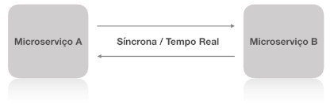
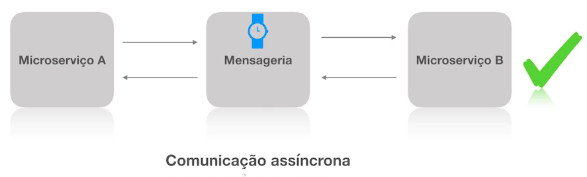
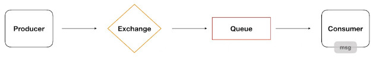
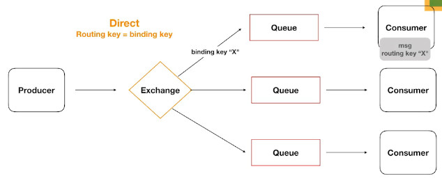
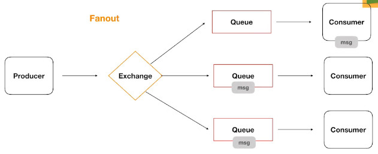
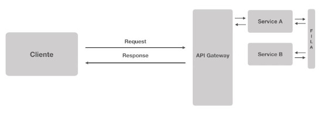
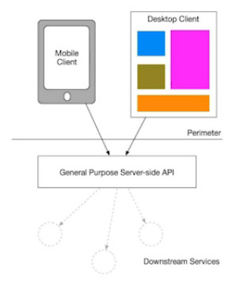
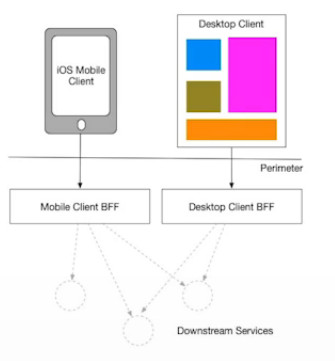

# Full Cycle Development

[Link de acesso ao treinamento](http://portal.code.education)

# Arquitetura de Software - Comunicação entre Microsserviços
---

# 1. Comunicação entre microserviços

Os microsserviços podem consultar outros microsserviços de forma síncrona ou assíncrona.

## Cenário Síncrono (mais comum, Resposta em tempo real)

(MSA) faz um "request síncrono" ao (MSB) e (MSA) recebe uma resposta de (MSB) em "tempo real".

## Cenário Síncrono - Processo Travado

(MSA) faz um "request síncrono" para (MSB), mas (MSA) fica "aguardando" a resposta de (MSB). 

Esse "aguardando" pode demorar um pouco, o que acaba "travando" o processo do (MSA). Não é coerente fazer com que o "chamador" fique aguardando uma resposta por 10s, 20min ou 1h.

## Cenário Assíncrono - Mensageria

(MSA) faz uma requisição para o (Serviço de Mensageria - SMSG), que por sua vez encaminhará a requisição para o (MSB)

Neste cenário, (MSA) não aguarda uma resposta imediata, ele já é preparado para que faça a requisição e siga o seu fluxo sem aguardar uma resposta imediada, podendo inclusive continuar enviando outras requisições para o (SMSG) destinadas ao (MSB).

Por sua vez, o (SMSG) aguarda a retirada da fila de mensagens a serem processadas pelo (MSB), enquanto isso não ocorre, as requisições ficam armazenadas e enfileiradas na ordem em que foram criadas.

O (MSB) retira uma mensagem de requisição da fila de (SMSG), realiza o processamento e "pode ou não" enviar uma mensagem para uma "fila de respostas" destinada ao (MSA). Fazendo isso, retira outra mensagem de requisição da fila e continua o seu processamento.

Isso evita que haja interrupções dos serviços caso os serviços que receberão as requisições estejam indisponíveis.

# 2. Exemplo do RabbitMQ

## Mecanismo de filas - RabbitMQ

- O RabbitMQ é um Message Broker
  - (*Broker* é um intermediário. Ex.: corretor de imóveis)
- Implementa o protocolo AMQP (Advanced Message Queuing Protocol)
- Producer <=> Brokers <=> Consumers
  - Producer :: Produz a requisição, inicia todo o processo;
  - Broker :: Faz a intermediação
  - Consumer :: Processa as requisições
- Possibilita o desacoplamento entre serviços
- É rápido e poderoso. 
  - Há outras soluções desse tipo.
- Padrão de mercado.

Ver: RabbitMQ in 5 Minutes
https://www.youtube.com/watch?v=deG25y_r6OY

## Cenário Básico

O (Producer) envia a requisição para um (Exchange) que por sua vez decide para qual (Queue) a requisição deverá ser encaminhada. O (Consumer), por sua vez, sabe de qual (Queue) deve obter as suas mensagens para processar as requisições.

## Cenário Direct - Múltiplas queues - Envio para apenas uma fila

Normalmente temos diversas (Queue)s, e possivelmente muitas (Exchange)s.

[Routing key]  ==> [Binding key]

O (Producer) e o (Exchange) lidam com um elemendo chamado de [binding key], uma chave que combina com outra chave denominada [routing key], e essa combiinação determina para qual (Queue) a requisição será encaminhada.

## Cenário Fanout - Múltiplas queues - Envia para todas as filas

O (Producer) envia o requestt (msg) para o (Exchange), que se encarrega para distribuir as msg para todos os (Consumers) regstrados.

\* Há outras formas/cenários para direcionar as mensagens (header, partial, etc).

# 3. Dupla Latência

Performance / Desempenho

## Cenário - Acesso a um Sistema Monolítico

O (Cliente) faz um request para o (Sistema Monolítico), e este, por sua vez processa a requisição e devolve uma "response" para o (Cliente).

O "caminho percorrido" é bem curto.

## Cenário - Baseado em Microsserviços

1. O (Cliente) faz uma requisição que chega até a (API Gateway)
2. A (API Gw) direciona o "request" para (MSA)
3. O (MSA), por depender do (MSB), envia um "request" para a (Queue)
4. O (MSB) obtém o "request" da (Queue) e realiza o processamento
5. O (MSB) devolve a resposta para (Queue)
6. O (MSA) retira a resposta da (Queue) e responde ao (Cliente)

O camiho percorrido é bem mais longo do que se estivéssemos usando um sistema monolítico. Nunca será tão rápido como no outro cenário.

Perceber que os microsserviços acrescentam uma complexidade enorme, e que não deve ser implementado/tratado como "modinha". Devem ser usado somente quando houver justificativa para isso, porque geram um ônus que deve a todo custo ser evitado.

\* Imperativo: medir o tempo de processamento e resposta de cada ms.

# 4. Backend for Frontend

Ver: BFF - Backend for Frontend
https://samnewman.io/patterns/architectural/bff/

Criação de uma camada intermediária baseada nos tipos de dispositivos que são usadas no Frontend (celulares, TVs, etc), sendo essa camada intermediária, seleciona quais "pedaços" de informação são adequados para o dispositivo antes de devolver a resposta.

Isso faz com que o client não seja sobrecarregado com o excesso de informações que não utilizará, bem como não sobrecarregue o backend gerando informações que seriam descartadas.

# 5. Atividade II

Normalmente a comunicação entre microserviços se dá através de:

- ( ) Service Discovery
- (x) Serviços de mensageria
- ( ) API Gateway

FAN OUT pode ser considerado:

- ( ) Uma forma de especificar em qual fila uma mensagem deve ser entregue
- ( ) É um formato de routing key
- ( ) Um formato de binding key
- (x) Uma forma de distribuir uma mensagem para todas as filas

RabbitMQ implementa o protocolo:

- ( ) RTMP
- ( ) XMLRPC
- ( ) REST
- (x) AMQP

Dupla latência pode ser considerada quando:

- ( ) Quando microserviços utilizam filas para se comunicar
- ( ) Quando um processo de rollback é necessário
- ( ) Quando um ou mais microserviços são independentes
- (x) Microserviços precisam se comunicar antes de uma response ser enviada

Quando uma mensagem é enviada e a routing key é idêntica a binding key, ela é considerada do tipo:

- ( ) Single
- (x) Direct
- ( ) Topic
- ( ) One way communication

Um Service Discovery conta com um ________ para buscar os serviços disponíveis

- ( ) Domain Registry
- (x) Service Registry
- ( ) Image Registry
- ( ) Service Container Registry
- ( ) Container Registry

Quando um microserviço solicita de outro uma informação diretamente, normalmente a comunicação é:

- (x) Síncrona
- ( ) SOAP
- ( ) REST
- ( ) Assíncrona
- ( ) Baseada no RabbitMQ

Normalmente a comunicação assíncrona:

- (x) Evita que processos fiquem travados quando recebem uma solicitação
- ( ) Fazem com que processos fiquem travados quando recebem uma solicitação

BFF significa:

- (x) Backend for frontend
- ( ) Best Friends Forever
- ( ) Backend facades
- ( ) Back to front

Service discovery pode ser considerado:

- (x) Um processo que auxilia mecanismos de identificação dos serviços disponíveis e suas instâncias
- ( ) É um processo que a partir de uma exchange consegue descobrir quais os serviços uma aplicação deve ser redirecionada
- ( ) É considera um producer que através de uma exchange consegue descobrir os serviços que são considerados um consumer
- ( ) Tem o objetivo de identificar os load balancers disponíveis no Kubernetes

Uma API Gateway também:

- ( ) É responsável pelo processo de Service discovery
- ( ) Gera CRUD automáticos
- ( ) Pode ser utilizada como um servidor web
- (x) Pode tratar de aspectos de segurança e autenticação da aplicação

Qual ferramenta NÃO é utilizada para Service Discovery?

- (x) NetKeeper
- ( ) Consul
- ( ) Etcd
- ( ) Eureka
- ( ) ZooKeeper

API Gateway pode ser considerado:

- ( ) API Gatway é uma forma de geral endpoints dinâmicos para a aplicação
- ( ) Tem a responsabilidade de trabalhar e gerar tokens de acesso entre aplicações
- (x) Recebe todas as chamadas dos clientes e as roteia para os serviços correspondentes
- ( ) É a principal forma de validar questões de segurança entre microserviços 

Quais são os dois tipos de utilização de um Service Discovery:

- (x) Server side e Client side
- ( ) Interno e Externo
- ( ) API Gateway e rotas dinâmicas
- ( ) BFF e Service Registry
- ( ) Backend e Frontend

