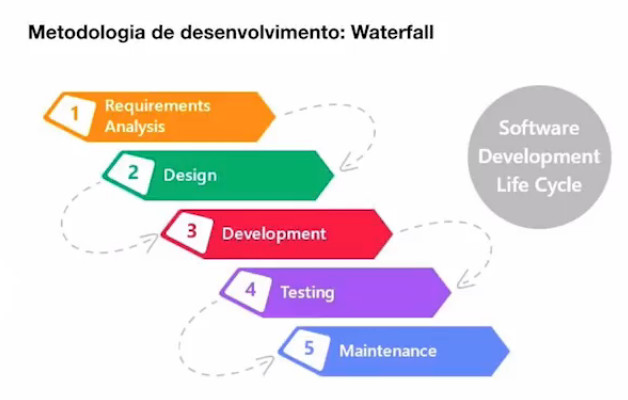
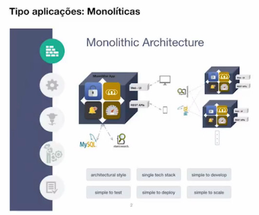
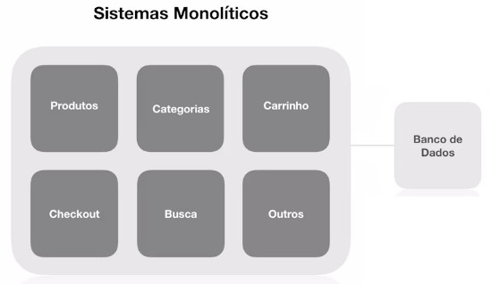
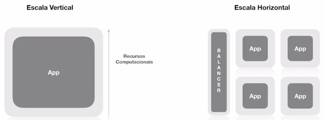
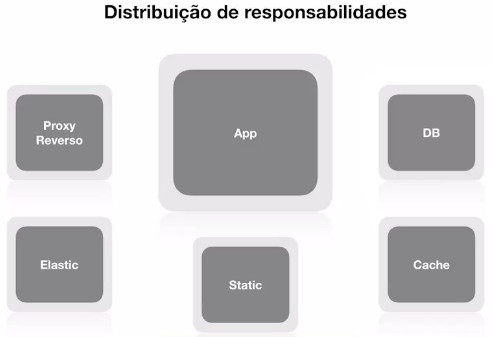
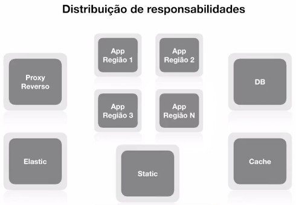

# Full Cycle Development

[Link de acesso ao treinamento](http://portal.code.education)

# Arquitetura de Software - Introdução
---

# 1. Introdução a Arquitetura de Software

## O que é Arquitetura?

> "Organização de um sistema, contemplando os seus componentes, os relacionamentos entre eles e o ambiente, e os princípios que governam o seu projeto e evolução."

\* Definição: ISO 42010:2011

## Palavras chave / Pilares da Arq. Sw.

- Organização de um sistema
  - Software e processo que o envolve
- Componentização
  - É com a junção dos componentes que conseguimos que um sistema fique completo. 
- Relacionamento entre sistemas
  - Os softwares têm que se integrarem. A comunicação existe.
- Governança
  - Forma como o processo de arquitetura será documentado;
  - Forma de definição dos times;
  - Definição das tecnologias;
  - Definição do BD, as integrações, e toda a solução que será fornecida.
  - Levam em consideração:
    - Infraestrutura
    - Time
    - Arquitetura (como as coisas serão integradas, principalmente com itens externos)
- Ambiente
  - Ambientes de produção, testes, desenvolvimento, homologação, etc.
  - Porém existe uma padronização dos ambientes antes mesmo de começarmos a desenvolver.
- Projeto
  - Projeto não significa SW. É algo que tem início, meio e fim. 
  - No processo de construção de um projeto, a parte de Arq. de SW deve ter um projeto à parte: o projeto de arquitetura.
- Projeção
  - Não pensar somente na situação atual do SW, no que ele faz atualmente, mas sim no que ele poderá atender/fazer no futuro.
  - Isso para projetos que já foram implantados e podem ser modernizados
- Cultura
  - Gerenciamento de conflitos trazidos por integrantes das equipes.
  - Alinhamento sobre quais tecnologias usar.
    - Ex.: Implantar cultura de DevOps. Todos devem estar aptos.

## Cenário atual: Microserviços

As equipes acabam usando tecnologias diversas, pois cada microserviço é isolado. Isso traz um problema futuro, pois as equipes mudam, o conhecimento fica perdido, e a manutenção mais custosa.

A abordagem é usar as principais tecnologias que a empresa usa, e investe no uso de um subset desse conjunto, para não ficar tão "plural".

## Frameworks

> Frameworks são ferramentas e métodos que nos ajudam a focar essencialmente no objetivo final. Frameworks nos ajudam a definir um padrão de trabalho.

Recomenda-se estar antenado em:

- The TOGAF Standard
- ISO

## TOGAF

- Framework conceitual
- Definição dos processos de arquitetura
- +900 páginas (muito formal e verboso)
- Conceitos de Arquitetura e nomenclaturas
- Visão geral dos principais tipos de arquiteturas:
  - Negócio
  - Sistemas de informação
  - Tecnologia
  - Planos de migração

## ISO/IEC/IEEE 42010 - System and Software engineering - Architecture description

- Lançado em 2011 pela ISO. 
- Mais simplificado em relação as 900 páginas do TOGAF
- Formaliza os fundamentos da área de arquitetura de sw.

# 2. Momentos da Arquitetura na História

São 4 momentos:

- Tradicional
- Atual
- Emergente
- Futuro

Separadas em três pontos principais:

- Metodologias (Métodos de Trabalho)
- Tipos de Aplicação
- Infraestrutura

## Momento: Tradicional

- Metodologia de desenvolvimento: Waterfal
- Tipo aplicações: Monolíticas
- Infraestrutura: on-premisse

## Momento: Atual

- Metodologia de desenvolvimento: Agile
- Tipo aplicações: Multi-tier architecture (sw. distribuído)
- Infraestrutura: Virtualização (ainda grande parte do mercado)

## Momento: Emergente

- Metodologia de desenvolvimento: DevOps / Full Cycle (cultura)
- Tipo aplicações: Microserviços
- Infraestrutura: Containers

> **Full Cycle** Origem do nome: publicação da Netflix em que era questionado o desempenho de um dev Full Stack. O Full Stack tem uma grande vantagem de fazer uma tarefa até o final. 

## Momento: Futuro

- Metodologia de desenvolvimento: NoOps
- Tipo aplicações: Serverless Applications  (Ex.: Lambdas)
- Infraestrutura: Public Cloud

# 3. Introdução a Escalabilidade e Sistemas Monolíticos

## Sistemas tradicionais: Características

- Tudo está dentro do mesmo sistema
  - modelagem, regras negócio, entidades, integrações, etc
- Alto acoplamento 
  - Partes do sistema não funcionam de forma independente
- Processo de Deploy "completo" a cada mudança
- Normalmente usa uma tecnologia (única)
- Um problema afeta todo o sistema
- Maior complexidade para times

Não significa que sistemas monolíticos são ruins.

- Não é crime usar sistema monolítico
- Na maioria dos casos vai entender
- Menor complexidade na maioria dos casos
- Sistema monolítico é Vida!

## Escalando Software

- Escala Vertical
  - Aumentar os Recursos Computacionais
- Escala Horizontal
  - Adiciona mais máquinas para processar/distribuir a carga via "balanceador"

## Detalhes sobre a arquitetura da aplicação

- Disco efêmero
  - As informações contidas nesses discos são temporárias
- Servidor de aplicação vs Servidor de assets (ativos)
  - Arquivos estáticos 
- Cache centralizado
  - Pensar que não contaremos com apenas uma máquina
- Sessões centralizadas
  - Idem
- Upload / Gravação de Arquivos
  - Idem (assets)

Tudo pode ter que ser destruído e criado facilmente.

O objetivo é alcançar a capacidade de fazer isso.

# 4. Distribuição de Responsabilidades

## Distribuição de responsabilidades dos sistemas

Quando queremos fazer com que uma aplicação cresça "horizontalmente" em vez de "verticalmente", começam a surgir diversos impeditivos que normalmente atrapalham no processo de desenvolvimento de software.

Desenvolver software hoje requer a habilidade de fazer isso dividindo/delegando as responsabilidades, evitando que o software acabe fazendo coisas que não deveriam fazer parte dele.

- Proxy Reverso (Ex. NGinx)
- Static (assets: imagens, uploads)
- DB (recomendação de usar serviços como o RDS da AWS)

...mas ...ainda assim, trata-se de uma aplicação monolítica (não interessa se está usando container ou não).

Com essa moda dos "microsserviços", muita gente que faz a distribuição desses componentes como Cache, DB, etc.; acredita que está usando o conceito de "microsserviço", mas na realidade não é isso o que estão fazendo. Esse tipo de aplicação continua sendo "monolítica".

É totalmente possível trabalhar com apps monolíticas em escala horizontal, mas isso não significa estar fazendo "microsserviços".

## Escala horizontal: Aplicação monolítica

- Ter imagens 
  - Ex.: AMI da AWS
  - Containers. Ex.: Docker
- Deve ser facilmente reconstruída
  - E se perder a máquina?
- Ter suas responsabilidades, incluindo assets, etc.
- Sim, aplicações monolíticas podem ser totalmente escaláveis.

## Quando as aplicações monolíticas podem parar de valer a pena?

- Times grandes 
  - Começam a surgir conflitos de commits, modificações indesejadas no código, e é óbvio que ocorrerão mais problemas.
- Necessidade de escalar todo o sistema pelo fato de uma área específica do sistema estar com pico de utilização. 
  - Exemplo: Com frequência solicitamos a criação de novas instâncias porque a função de Consulta ao Catálogo de Produtos está sobrecarregada, enquanto o restante do sistema é subutilizado. Fica claro que o problema gera um custo adicional devido a uma única funcionalidade do sistema.
- O risco de um deploy completo começa a se elevar
  - Exemplo: Conforme uma aplicação vai crescendo, e se está crescendo é porque está sendo muito utilizada e se tornando mais crítica, começam a surgir problemas como "- E se fizermos um deploy da aplicação e cair tudo?". 
  - Cenário: Foi feita uma pequena modificação no template da área administrativa, que não tem importância para o meu usuário final, mas precisa ser aplicada. Arriscaríamos fazer o deploy e fazer com que o sistema "caia", com que o "Catálogo de Produtos" deixe de funcionar e ocorram perdas nas vendas? Quando surge esse tipo de dúvida, indica que o processo de deploy está ficando perigoso.
- Necessidade de usar tecnologias diferentes

