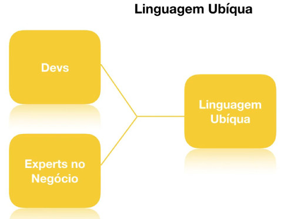
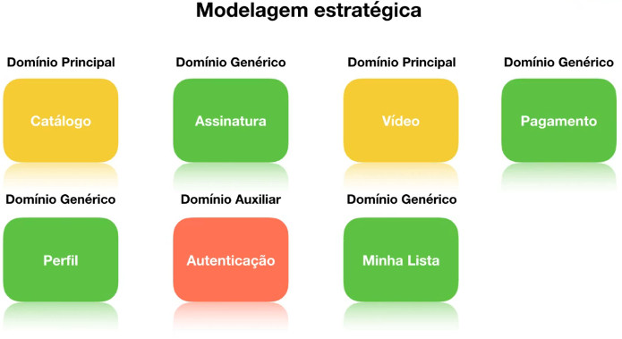
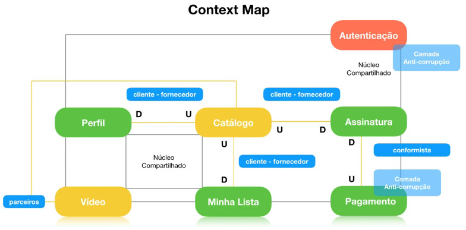
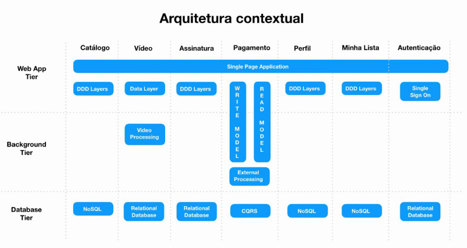
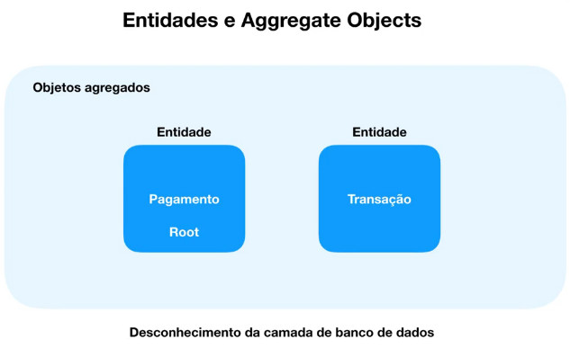
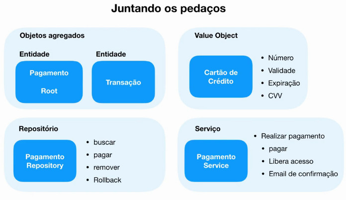

# Full Cycle Development

[Link de acesso ao treinamento](http://portal.code.education)

# Arquitetura de Software - Domain Driven Design
---

# 1. Domain Driven Design: O que você precisa saber

## O que é DDD

É um conjunto de princípios com foco em:

- Domínio
- Exploração de modelos de forma criativa
- Definir e falar a **Linguagem Ubíqua** baseada em um contexto delimitado

Fonte: https://gojko.net/2010/06/11/eric-evans-domain-driven-design-redefined


## O que é um domínio?

> Domínio é o coração do negócio que você está trabalhando. É baseado em um conjunto de ideias, conhecimento e processos de negócio.

\* É a Razão de um negócio existir. É a razão do software existir.

Sem domínio, todo os sistemas em volta e todos os processos auxiliares não servem pra nada. Se uma empresa existe é porque ela tem um core busines e este é composto de um domínio principal.

## Exploração de modelos criativos

> O DDD preza que os desenvolvedores façam parte do processo de entender o negócio e todos os seus modelos, nos mais diversos ângulos, em vez de simplesmente entrevistar especialistas.

## Definir e falar a linguagem Ubíquia

> A **Linguagem Ubíqua** é a linguagem falada no cotidiano no contexto da empresa. É a linguagem que utiliza as terminologias da realidade do negócio.

Exemplo: Os termos Usuário e Cliente, dependendo de quem lê, podem significar:

- Usuário pode ser uma pessoa que está "logada" no sistema
- "Cliente" é a pessoa que loga no sistema
- "Cliente" é uma aplicação que se conecta com o sistema

Cliente é o quê? Depende da empresa.

## Quando e por quem foi "criado"

- Livro: Domain-Driven Design
- Eric Evans - 2003
- Utilizado para aplicações complexas
- Fácil de entender
- Difícil de aplicar
- Utilização de diversos padrões de projetos

## Os três pilares do DDD

- Linguagem Ubíqua
- Bounded Contexts
- Context Maps


## Linguagem Ubíqua




## Linguagem Ubíqua - Exemplo de Glossário

- Playback
  - Processo de execução de um vídeo
- Vídeo
  - Conteúdo que será visto pelo usuário
- Capa
  - Figura descritiva de um vídeo
- Perfil
  - Perfil gerado pelo usuário para separar os utilizadores e suas preferências e "Minha Lista"
- Minha Lista
  - Lista de vídeos usada pelo usuário armazenar os vídeos que tem interesse em ver depois
- Título
  - Nome do vídeo
- Pessoas
  - Personagens que fazem participação em um determinado vídeo
- Gênero
  - Estilo que define o tipo de um vídeo. Ex.: Drama, Terror, Comédia
- Catálogo
  - Catálogo de vídeos disponibilizados

\* Precisa estar registrado em algum lugar de fácil acesso (wiki, Google Docs, intranet, etc).


## Bounded Contexts

- Delimita os contextos da aplicação
- Cada contexto possui suas responsabilidades claramente definidas
- Cada contexto pode ter sua própria linguagem Ubíqua
  - Exemplo: Cliente é diferente para o departamento de Vendas e Marketing
- Utilização de histórias e levantamento do escopo do projeto com o "domain expert" auxilia no processo de delimitação de contextos

## Bounded - Exemplo de História

- Cria uma conta para acessar o sistema
- Faz o login
- Seleciona o plano de acesso e realiza a assinatura
- Cria um perfil de acesso
- Navega no catálogo de vídeos
- Realiza uma busca através do título e/ou gênero
- Adiciona os vídeos que tem interesse em sua lista
- Acessa o vídeo escolhido e faz o playback

Especificação bem simples, mas possibita a extração de muitas informações para delimitar os contextos, definir as entidades e definir as ações a serem realizadas.

Palavras que normalmente tendem a se transformar em entidades:

- Cria uma **conta** para acessar o sistema
- Faz o **login**
- Seleciona o **plano** de acesso e realiza a **assinatura**
- Cria um **perfil** de acesso
- Navega no **catálodo** de **vídeos**
- Realiza uma **busca** através do **título** e/ou **gênero**
- Adiciona os **vídeos** que tem interesse em sua **lista**
- Acessa o **vídeo** escolhido e faz o **playback**

Agora focando nas ações:

- **Cria uma conta** para acessar o sistema
- **Faz o login**
- **Seleciona o plano** de acesso e **realiza a assinatura**
- **Cria um perfil** de acesso
- **Navega no catálogo de vídeos**
- **Realiza uma busca através do título e/ou gênero**
- **Adiciona os vídeos que tem interesse em sua lista**
- **Acessa o vídeo** escolhido e **faz o playback**

Isso possibilita definir quais serão as **ações principais** do sistema, quais são os **participantes** e qual é a **relação** de cada um deles com o sistema.


## Modelagem Estratégica

Definição dos contextos a serem usados no sistema:



- Domínio Principal: O sistema não existe sem ele(s)
- Domínio Genérico: Ajuda em todo o processo. Faz com que o Domínio Principal funcione.
- Domínio Auxiliar


## Context Map

Mapa de relacionamento entre os contextos



O *Catálogo* faz parte do *Domínio Principal* (domínio forte). Os demais domínios devem respeitar um *Domínio Principal*, ou seja, se for necessário modificar algo no *Catálogo*, os demais domínios que dele dependem é que deverão se "adaptar", e não o contrário.

Direção de comunicação:

- U : Upstream
  - Quem fornece
- D : Downstream
  - Quem usa

**Núcleo Compartilhado**: Compartilham classes, interfaces, soluções, métodos, etc.

## Arquitetura Contextual




## Domain Model Patterns

- São padrões de desenvolvimento e estruturação de aplicações cujo domínio é o principal foco
- Focados em Entidades de Agregadores
- Objetos de valor
- Repositórios
- Serviços


Fonte: https://martinfowler.com/tags/domain%20driven%20design.html


## Entidades e Aggregate Objects




## Objetos de Valor (Value Objects)

- Imutáveis
- Coleção de atributos
- Normalmente não possuem métodos setters
- Entrada dos valores por um construtor
- Tipagem forte em vez da utilização de dados primitivos

Exemplo simples:
```
String endereço = "Rua José da Silva, 82, Centro, São Paulo";

Endereco endereco = construtor("Rua José da Silva", 82, "Centro", "São Paulo");
```

## Repositórios

- Tem acesso direto a camada de dados
- Persiste dados utilizando as entidades
- Possui os métodos necessários para realizar consultas
- Utilize sempre um repositório por agregação
- Pode consultar diretamente serviços externos

Exemplo: Utilize sempre um repositório por agregação
Supondo que temos *Pedido*, *Pedido Item* e *Transação do Pedido*. Cada um deles é uma entidade, mas fazem parte de um objeto agregador. Ao criar o repositório, não se deve criá-lo por entidade, mas sim por "objeto agregador". Ou seja, não será criado um repositório chamado *Pedido Item*, mas sim um repositório *Pedido* que incluirá *Pedido*, *Pedido Item*, *Transação do Pedido*. 


## Serviços de Domínio

- Implementam lógica de negócios a partir da fefinição de um expert de domínio
- Trabalham com diversos fluxos de diversas entidades e agregações
- Utilizam os repositórios como interface de acesso aos dados
- Consomem recursos da camada de infraestrutura como enviar e-mail, disparar eventos, entre outros.


