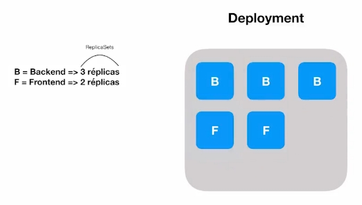
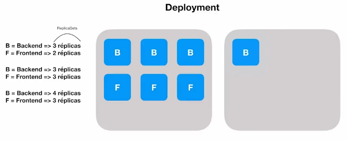
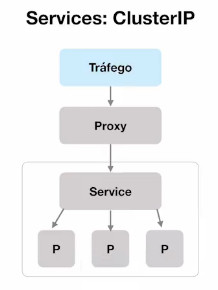
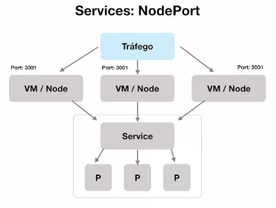
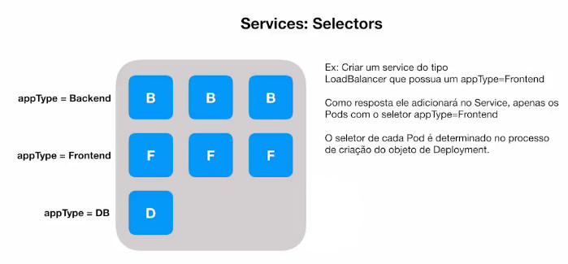

# Full Cycle Development

[Link de acesso ao treinamento](http://portal.code.education)

# DevOps -  Kubernetes
---

# 1. Introdução ao Kubernetes

Orquestrador/gerenciador de contêineres.

## O que é o Kubernetes?

> Fonte: [kubernetes.io](https://kubernetes.io/pt/)  
>> Kubernetes (K8s) é um produto Open Source utilizado para automatizar a implantação, o dimensionamento e o gerenciamento de aplicativos em contêiner.

## De onde veio?

Surgiu no Google. Projetos que deram origem:

1. Borg
2. Omega
3. Kubernetes

## Pontos importantes

1. Kubernetes é disponibilizado através de um conjunto de APIs
2. Normalmente acessamos a API usando a CLI: `kubectl`
3. Tudo é baseado em estado. Você configura o estado de cada objeto
4. Kubernetes Master  (Cluster)
   1. Kube-apiserver
   2. Kube-controller-manager
   3. Kube-scheduler
5. Outros Nodes:
   1. Kubelet
   2. Kubeproxy

## Dinâmica "superficial"

1. **Cluster** Conjunto de máquinas (Nodes)
   1. Cada máquina possui uma quantidde de vCPU e Memória


2. **Pods** Unidade que contém os contêineres provisionados
   1. O Pod representa os processos rodando no cluster
   2. Pode-se ter mais de um contêiner em cada Pod, mas são raras as vezes em que isso se torna necessário.


3. **Deployment** outro tipo de objeto que tem o objetivo de aprovisionar os pods
   1. Para aprovisionar os pods, ele precisa saber quantas réplicas serão disponibilizadas, e isso é informado através dos ReplicaSets (quantas réplicas de cada set)




Caso o número exigido por algum **ReplicaSet** aumente e não haja recursos computacionais disponíveis, o K8s deixará a execução pendente até que surjam as condições adequadas.


Caso isso ocorra e haja outro **Node** disponível, os pods serão criados no outro Node, desde que haja recursos disponíveis.




# 2. Entendendo Services

Interface de comunicação entre o mundo externo e os pods.

## Services
É uma forma de agregar um conjunto de pods para então implementar políticas de visibilidade.

### Tipos de Services - Principais

* ClusterIP
* NodePort
* LoadBalancer

### Services - Cluster IP

Neste caso, os acessos são feitos apenas dentro do cluster. Não há acesso do mundo externo. O acesso é feito através do **Proxy**, que sabe para qual **Service** encaminhar a requisição, e este por sua vez sabe qual **Pod** está disponível para fazer o atendimento.




### Services - NodePort

O **NodePort** não trabalha com **Proxy** para resolver o **Service**, em vez disso temos **Ports TCP** atribuídos em cada **Node** destinado a um **Service** específico.




### Services - LoadBalancer

A ideia principal do **LoadBalancer** é a de expor um IP externo (ex.: Internet), e quando o tráfego chegar até o LB, ele verifica a carga, e a distribui para o **Node** / **Service** adequado.


### Services - Selectors

O **Selector** é definido no **Service** para que seja feito um filtro para verificar quais **Pods** serão colocadas dentro do **Service**.



Quando é feito o deploy, o seletor de cada **Pod** é definido para que seja feita a seleção pelo **Service** adequado.


# 3. Instalando Minikube

O Minikube é uma ferramenta que facilita a execução do K8s localmente, disponibilizando um cluster single-node (apenas um único node) em uma Máquina Virtual. É recomendado apenas para o uso em testes e desenvolvimento (em um notebook por exemplo), pois é limitado e não oferece todos os recursos.

Website: [Installing Kubernetes with Minikube](https://kubernetes.io/docs/setup/learning-environment/minikube/)

\* Não foi feita a instalação, pois já uso o KinD.
\* A instalação do Minikube já instala o `kubectl`

# 3.1. Instalação do Kind 

\* Não faz parte do treinamento, mas achei melhor anotar

O KinD (Kubernertes in Docker) é uma ferramenta para executar **clusters** K8s localmente, usando contêineres Docker como sendo os seus **Nodes**.

Foi inicialmente projetado para testar o próprio Kubernetes, mas é outra alternativa para testes, aprendizado, desenvolvimento local e processo de CI.

Website: [Installing Kubernetes with Kind](https://kubernetes.io/docs/setup/learning-environment/kind/)  
Guia Rápido: [Quick Start](https://kind.sigs.k8s.io/docs/user/quick-start/)

## Instalação no Linux

```
$ curl -Lo ./kind https://kind.sigs.k8s.io/dl/v0.8.1/kind-$(uname)-amd64
$ chmod +x ./kind
$ sudo mv ./kind /usr/local/bin/kind
```

## Criação de um cluster

```
$ kind create cluster

Creating cluster "kind" ...
 ✓ Ensuring node image (kindest/node:v1.18.2) 🖼 
 ✓ Preparing nodes 📦  
 ✓ Writing configuration 📜 
 ✓ Starting control-plane 🕹️ 
 ✓ Installing CNI 🔌 
 ✓ Installing StorageClass 💾 
Set kubectl context to "kind-kind"
You can now use your cluster with:

kubectl cluster-info --context kind-kind

Thanks for using kind! 😊
```

Será criado um cluster com o nome "kind" por padrão. Para atribuir um nome de contexto diferente para o cluster, deve-se usar a flag `--name`.

```
$ kind create cluster --name dfdx-cluster

Creating cluster "dfdx-cluster" ...
 ✓ Ensuring node image (kindest/node:v1.18.2) 🖼 
 ✓ Preparing nodes 📦  
 ✓ Writing configuration 📜 
 ✓ Starting control-plane 🕹️ 
 ✓ Installing CNI 🔌 
 ✓ Installing StorageClass 💾 
Set kubectl context to "kind-dfdx-cluster"
You can now use your cluster with:

kubectl cluster-info --context kind-dfdx-cluster

Not sure what to do next? 😅  Check out https://kind.sigs.k8s.io/docs/user/quick-start/
```

## Visualizar os clusters

```
$ kind get clusters
```

## Listar os nodes de um cluster

\* O `kubectl` deve ser instalado antes (vide item **3.2. Instalação do kubectl**)

```
$ kubectl get nodes

NAME                         STATUS   ROLES    AGE   VERSION
dfdx-cluster-control-plane   Ready    master   36m   v1.18.2

```

# 3.2. Instalação do kubectl

\* Não faz parte do treinamento, mas achei melhor anotar

O `kubectl` é um cliente que possibilita a comunicação com clusters do K8s.

Guia de instalação do kubectl: [Install and Set Up kubectl](https://kubernetes.io/docs/tasks/tools/install-kubectl/)

Instalação:

```
$ curl -LO https://storage.googleapis.com/kubernetes-release/release/`curl -s https://storage.googleapis.com/kubernetes-release/release/stable.txt`/bin/linux/amd64/kubectl

$ chmod +x ./kubectl

$ sudo mv ./kubectl /usr/local/bin/kubectl
```

Para testar se deu tudo certo:

```
$ kubectl version --client
```


## kubectl: alias e autocomplete

Guia de instalação do kubectl: [Optional kubectl configurations]
https://kubernetes.io/docs/tasks/tools/install-kubectl/#optional-kubectl-configurations

Execute o seguinte comando para configurar o alias e autocomplete para o kubectl.

### No Bash

```
$ echo 'source <(kubectl completion bash)' >>~/.bashrc
$ sudo -i
# kubectl completion bash >/etc/bash_completion.d/kubectl
```

Se tiver um alias para o `kubectl`, é possível extender o autocomplete para trabalhar com o alias:

```
$ echo 'alias k=kubectl' >>~/.bashrc
$ echo 'complete -F __start_kubectl k' >>~/.bashrc
```

### No ZSH

Adicionar a linha seguinte no arquivo `~/.zshrc`:

```
source <(kubectl completion zsh)
```

Se tiver um alias para o `kubectl`, é possível extender o autocomplete para trabalhar com o alias:


```
$ echo 'alias k=kubectl' >>~/.zshrc
$ echo 'complete -F __start_kubectl k' >>~/.zshrc
```

# 3.3. Retornando para o conteúdo da aula

Foi feita a remoção do cluster criado no teste anterior, mantendo apenas o cluster padrão (kind):

```
$ kind delete clusters dfdx-cluster
```

Listar os serviços (Apenas para validação):
```
$ kubectl get svc
NAME         TYPE        CLUSTER-IP   EXTERNAL-IP   PORT(S)   AGE
kubernetes   ClusterIP   10.96.0.1    <none>        443/TCP   2m51s
```

Listar os pods (Apenas para validação):
```
$ kubectl get pods
No resources found in default namespace.
```

Listar os deployments (Apenas para validação):
```
$ kubectl get deployments
No resources found in default namespace.
```


# 4. Criando o nosso primeiro Pod

Será feita a criação de um pod de forma bem "artesanal", somente a título de exemplo. A criação de pods é feita normalmente usando *Deployments*, e não de forma "unitária". Isso será visto na sequência.

**arquivo:** pod.yaml
```
apiVersion: v1
kind: Pod
metadata:
  name: pod-exemplo
spec:
  containers:Deployment
  - name: pod-exemplo
    image: nginx:1.17-alpine
```

Aplicação do conteúdo do arquivo yaml para criar o pod:
```
$ kubectl apply -f pod.yaml
```

Verificação da situação do pod criado:
```
$ kubectl get pods
NAME          READY   STATUS    RESTARTS   AGE
pod-exemplo   1/1     Running   0          2m38s
```

Verificação do log:
```
$ kubectl logs pod-exemplo
(saída vazia - ok)
```

Mas como será feito o acesso ao NGinx que está rodando neste pod? 

Tudo o que recebe tráfego externo depende de um **Service**, que pode ser do tipo **ClusterIP**, **NodePort** ou **Loadbalancer**

Este **Pod** criado como exemplo será removido.

No próximo passo será feita a criação de um **Deployment**, que por sua vez criará o **Pod** . Depois será criado um **Service** para que possamos expor o **Deployment** que contém os **Pods**, para que possamos acessar o NGinx através do navegador.


# 5. Trabalhando com Deployments

## 5.1. Criação de Deployment de forma "artesanal" (na linha de comando)

Cria um **deployment**, que por sua vez cria um **pod** de apenas um container da imagem "nginx:1.17-alpine":
```
$ kubectl create deployment hello-nginx --image=nginx:1.17-alpine
```

Verificar a situação do deployment recém criado:
```
$ kubectl get deployments
NAME          READY   UP-TO-DATE   AVAILABLE   AGE
hello-nginx   1/1     1            1           54s
```

Verificar os **pods** criados:
```
$ kubectl get pods
NAME                           READY   STATUS    RESTARTS   AGE
hello-nginx-6485484cdf-t8mq6   1/1     Running   0          5m10s
```

Criar um **service** que possibilitará acessar o **pod** contendo o nginx (Não tem LoadBalancer no Minikube):
```
$ kubectl expose deployment hello-nginx --type=LoadBalancer --port=80
```


```
$ kubectl get services
NAME          TYPE           CLUSTER-IP      EXTERNAL-IP   PORT(S)        AGE
hello-nginx   LoadBalancer   10.103.99.137   <pending>     80:30564/TCP   92s
kubernetes    ClusterIP      10.96.0.1       <none>        443/TCP        12m
```

Com o Minikube, temos uma forma de "expor" o endereço do **service** para que possamos acessá-lo pelo navegador:

```
$ minikube service hello-nginx
```

Uma janela do navegador será aberta apontando para um endereço IP local (não o IP do Cluster), port 30564 (ou a que for exposta na ocasião).

/* Não consegui replicar isso com o KinD.

Remoção dos itens criados:

```
$ kubectl delete service hello-nginx 
service "hello-nginx" deleted
```

```
$ kubectl delete deployments hello-nginx 
deployment.apps "hello-nginx" deleted
```
ou, simplesmente:

```
$ kubectl delete deployments --all
```


## 5.2. Criação de Deployment declarativo (convencional - arquivo yaml)

Forma tradicional/convencional.


**arquivo:** deployment.yaml
```
apiVersion: apps/v1
kind: Deployment
metadata:
  name: hello-nginx  
spec:
  selector:
    matchLabels:
      app: hello-nginx
  template:
    metadata:
      labels:
        app: hello-nginx
    spec:
      containers:
      - name: nginx
        image: nginx:1.17-alpine
        ports: 
        - containerPort: 80
```


```
$ kubectl apply -f deployment.yaml 
deployment.apps/hello-nginx created
```

Verificar a situação do deployment recém criado:
```
$ kubectl get deployments
NAME          READY   UP-TO-DATE   AVAILABLE   AGE
hello-nginx   1/1     1            1           8m33s
```

Verificar os **pods** criados:
```
$ kubectl get pods
NAME                           READY   STATUS    RESTARTS   AGE
hello-nginx-67dd48d89b-krqtj   1/1     Running   0          8m42s
```


# 6. Criando nosso Service

**arquivo:** service.yaml
```
apiVersion: v1
kind: Service
metadata:
  name: nginx-service
spec:
  type: LoadBalancer
  ports:
  - port: 80
  selector: 
    app: hello-nginx
```


```
$ kubectl apply -f service.yaml 
service/nginx-service created
```


```
$ kubectl get service
NAME            TYPE           CLUSTER-IP     EXTERNAL-IP   PORT(S)        AGE
kubernetes      ClusterIP      10.96.0.1      <none>        443/TCP        14h
nginx-service   LoadBalancer   10.96.66.219   <pending>     80:30225/TCP   65s
```


Com o Minikube, temos uma forma de "expor" o endereço do **service** para que possamos acessá-lo pelo navegador:

```
$ minikube service hello-nginx
```

Uma janela do navegador será aberta apontando para um endereço IP local (não o IP do Cluster), port 30225 (ou a que for exposta na ocasião).

/* Não consegui replicar isso com o KinD.

# 7. Escalando Pods

Réplicas:

**arquivo:** deployment.yaml
```
apiVersion: apps/v1
kind: Deployment
metadata:
  name: hello-nginx  
spec:
  replicas: 3
  selector:
    matchLabels:
      app: hello-nginx
  template:
    metadata:
      labels:
        app: hello-nginx
    spec:
      containers:
      - name: nginx
        image: nginx:1.17-alpine
        ports: 
        - containerPort: 80
```


```
$ kubectl apply -f deployment.yaml 
deployment.apps/hello-nginx configured
```

Verificar os **pods** criados:
```
$ kubectl get pods
NAME                           READY   STATUS    RESTARTS   AGE
hello-nginx-67dd48d89b-5ksnc   1/1     Running   0          106s
hello-nginx-67dd48d89b-krqtj   1/1     Running   0          13h
hello-nginx-67dd48d89b-pptkq   1/1     Running   0          106s
```


```
$ kubectl get deployments
NAME          READY   UP-TO-DATE   AVAILABLE   AGE
hello-nginx   3/3     3            3           16h
```


# 8. Trabalhando com ConfigMap

Possibilitar a modificação das configurações/estados de objetos dos contêineres.

Neste exemplo, modificaremos o parâmetro de redirecionamento do arquivo ngnix.conf, para reescrever a URL e redirecionar para o google.com.

**arquivo:** configmap.yaml
```
apiVersion: v1
kind: ConfigMap
metadata:
  name: nginx-conf
data:
  nginx.conf: |
    server {
      listen 80;
      index index.php index.html;
      root /usr/share/nginx/html;

      rewrite ^/google$ https://google.com permanent;
    }
```

Criação do ConfigMap:
```
$ kubectl apply -f configmap.yaml 
configmap/nginx-conf created
```

Verificar se o ConfigMap está OK:
```
$ kubectl get configmaps
NAME         DATA   AGE
nginx-conf   1      49s
```

Uso do **ConfigMap** criado no **Deployment**:

**arquivo:** deployment.yaml
```
apiVersion: apps/v1
kind: Deployment
metadata:
  name: hello-nginx  
spec:
  replicas: 2
  selector:
    matchLabels:
      app: hello-nginx
  template:
    metadata:
      labels:
        app: hello-nginx
    spec:
      containers:
      - name: nginx
        image: nginx:1.17-alpine
        ports: 
        - containerPort: 80

        volumeMounts:
        - mountPath: /etc/nginx/conf.d
          name: nginx-conf
          readOnly: true
      
      volumes:
      - name: nginx-conf
        configMap:
          name: nginx-conf
          items:
            - key: nginx.conf
              path: nginx.conf
```


```
$ kubectl apply -f deployment.yaml
deployment.apps/hello-nginx configured
```

Verificar os **pods** criados:
```
$ kubectl get pods
NAME                           READY   STATUS    RESTARTS   AGE
hello-nginx-7797bd79df-6vp2t   1/1     Running   0          57s
hello-nginx-7797bd79df-m9v9j   1/1     Running   0          64s
```

Com o Minikube, temos uma forma de "expor" o endereço do **service** para que possamos acessá-lo pelo navegador:

```
$ minikube service hello-nginx
```

Uma janela do navegador será aberta apontando para um endereço IP local (não o IP do Cluster).

/* Não consegui replicar isso com o KinD.


# 9. Configurando Mysql do Zero

**arquivo:** deployment-mysql.yaml
```
apiVersion: apps/v1
kind: Deployment
metadata:
  name: mysql-server  
spec:  # spec do Deployment
  replicas: 1

  selector:  # selector usado para criar o service
    matchLabels:
      app: mysql-server
      tier: db

  template:  # referente ao POD
    metadata:
      labels:
        app: mysql-server
        tier: db
    spec:    # spec do POD
      containers:
      - name: mysql-server
        image: mysql:5.7
        env:
        - name: MYSQL_ROOT_PASSWORD
          value: root
        ports: 
        - containerPort: 3306
```


```
$ kubectl apply -f deployment-mysql.yaml 
deployment.apps/mysql-server created
```

```
$ kubectl get pods
NAME                            READY   STATUS    RESTARTS   AGE
hello-nginx-7797bd79df-6vp2t    1/1     Running   0          177m
hello-nginx-7797bd79df-m9v9j    1/1     Running   0          177m
mysql-server-6cbb9fbf57-k7zwp   1/1     Running   0          5m
```


# 10. Montando volume persistente no Mysql


Persistent Volumes

**arquivo:** persistent-volume.yaml
```
apiVersion: v1
kind: PersistentVolumeClaim
metadata:
  name: mysql-pv-claim
spec:
  accessModes:
    - ReadWriteOnce
  resources:
    requests:
      storage: 2Gi
```


```
$ kubectl apply -f persistent-volume.yaml 
persistentvolumeclaim/mysql-pv-claim created
```


```
$ kubectl get persistentvolumeclaim
NAME             STATUS    VOLUME   CAPACITY   ACCESS MODES   STORAGECLASS   AGE
mysql-pv-claim   Pending                                      standard       24m
```


```
$ kubectl describe pvc
Name:          mysql-pv-claim
Namespace:     default
StorageClass:  standard
Status:        Pending
Volume:        
Labels:        <none>
Annotations:   Finalizers:  [kubernetes.io/pvc-protection]
Capacity:      
Access Modes:  
VolumeMode:    Filesystem
Mounted By:    <none>
Events:
  Type    Reason                Age                    From                         Message
  ----    ------                ----                   ----                         -------
  Normal  WaitForFirstConsumer  3m53s (x142 over 39m)  persistentvolume-controller  waiting for first consumer to be created before binding
```


Montagem do volume:

**arquivo:** deployment-mysql.yaml
```
apiVersion: apps/v1
kind: Deployment
metadata:
  name: mysql-server  
spec:  # spec do Deployment
  replicas: 1

  selector:  # selector usado para criar o service
    matchLabels:
      app: mysql-server
      tier: db

  template:  # referente ao POD
    metadata:
      labels:
        app: mysql-server
        tier: db
    spec:    # spec do POD
      containers:
      - name: mysql-server
        image: mysql:5.7
        args:  # pulo-do-gato: ver anotações
          - "--ignore-db-dir=lost+found"
        env:
        - name: MYSQL_ROOT_PASSWORD
          value: root

        ports: 
        - containerPort: 3306

        volumeMounts: # monta o volume efetivamente
        - name: mysql-persistent-storage
          mountPath: /var/lib/mysql

      volumes: # definição do volume
      - name: mysql-persistent-storage
        persistentVolumeClaim:
          claimName: mysql-pv-claim
```

/* Normalmente, quando um volume é criado, um arquivo "lost+found" é criado neste volume. O MySQL requer uma pasta vazia no seu startup. Então, ou devemos formatar o volume, ou simplesmente ignorar o arquivo (o que é mais simples).

```
$ kubectl apply -f deployment-mysql.yaml 
deployment.apps/mysql-server configured
```


```
$ kubectl get pods
NAME                            READY   STATUS    RESTARTS   AGE
hello-nginx-7797bd79df-6vp2t    1/1     Running   0          5h5m
hello-nginx-7797bd79df-m9v9j    1/1     Running   0          5h5m
mysql-server-7d7cbdcfc7-mvbq9   1/1     Running   0          28s
```

```
$ kubectl get persistentvolumeclaims
NAME             STATUS   VOLUME                                     CAPACITY   ACCESS MODES   STORAGECLASS   AGE
mysql-pv-claim   Bound    pvc-2bb1308c-d01e-4451-9f60-e3f487805482   2Gi        RWO            standard       65m
```

```
$ kubectl describe pvc
Name:          mysql-pv-claim
Namespace:     default
StorageClass:  standard
Status:        Bound
Volume:        pvc-2bb1308c-d01e-4451-9f60-e3f487805482
Labels:        <none>
Annotations:   pv.kubernetes.io/bind-completed: yes
               pv.kubernetes.io/bound-by-controller: yes
               volume.beta.kubernetes.io/storage-provisioner: rancher.io/local-path
               volume.kubernetes.io/selected-node: kind-control-plane
Finalizers:    [kubernetes.io/pvc-protection]
Capacity:      2Gi
Access Modes:  RWO
VolumeMode:    Filesystem
Mounted By:    mysql-server-78dd6599b7-hn9zc
Events:
  Type    Reason                 Age                  From                                                                                               Message
  ----    ------                 ----                 ----                                                                                               -------
  Normal  WaitForFirstConsumer   10m (x222 over 65m)  persistentvolume-controller                                                                        waiting for first consumer to be created before binding
  Normal  Provisioning           10m                  rancher.io/local-path_local-path-provisioner-bd4bb6b75-ld9dk_4dec53ab-44ce-4d3b-8f31-4a7473ef6595  External provisioner is provisioning volume for claim "default/mysql-pv-claim"
  Normal  ProvisioningSucceeded  9m57s                rancher.io/local-path_local-path-provisioner-bd4bb6b75-ld9dk_4dec53ab-44ce-4d3b-8f31-4a7473ef6595  Successfully provisioned volume pvc-2bb1308c-d01e-4451-9f60-e3f487805482
```


# 11. Trabalhando com Secret no Mysql


```
$ kubectl create secret generic mysql-pass --from-literal=password='a1s2d3f4'
secret/mysql-pass created
```


**arquivo:** deployment-mysql.yaml
```
apiVersion: apps/v1
kind: Deployment
metadata:
  name: mysql-server  
spec:  # spec do Deployment
  replicas: 1

  selector:  # selector usado para criar o service
    matchLabels:
      app: mysql-server
      tier: db

  template:  # referente ao POD
    metadata:
      labels:
        app: mysql-server
        tier: db
    spec:    # spec do POD
      containers:
      - name: mysql-server
        image: mysql:5.7
        args:  # pulo-do-gato: ver anotações
          - "--ignore-db-dir=lost+found"
        
        env:
        - name: MYSQL_ROOT_PASSWORD
          valueFrom: 
            secretKeyRef:
              name: mysql-pass
              key: password

        ports: 
        - containerPort: 3306

        volumeMounts: # monta o volume efetivamente
        - name: mysql-persistent-storage
          mountPath: /var/lib/mysql

      volumes: # definição do volume
      - name: mysql-persistent-storage
        persistentVolumeClaim:
          claimName: mysql-pv-claim
```

```
$ kubectl apply -f deployment-mysql.yaml 
deployment.apps/mysql-server configured
```


# 12. Criando Mysql Service 


**arquivo:** service-mysql.yaml
```
apiVersion: v1
kind: Service
metadata:
  name: mysql-service
spec:
  ports:
  - port: 3306
  selector:
    app: mysql-server
    tier: db
  clusterIP: None
```

/* Não foi definido um IP para esse service, pois não será acessado de fora do cluster. Basta acessar pelo nome.

```
$ kubectl apply -f service-mysql.yaml 
service/mysql-service created
```

```
$ kubectl get svc
NAME            TYPE           CLUSTER-IP     EXTERNAL-IP   PORT(S)        AGE
kubernetes      ClusterIP      10.96.0.1      <none>        443/TCP        25h
mysql-service   ClusterIP      None           <none>        3306/TCP       32s
nginx-service   LoadBalancer   10.96.66.219   <pending>     80:30225/TCP   11h
```

O volume anterior será removido, para que seja recriado com a senha
```
$ kubectl delete persistentvolumeclaim mysql-pv-claim
persistentvolumeclaim "mysql-pv-claim" deleted
```

```
$ kubectl delete deployment mysql-server
deployment.apps "mysql-server" deleted
```

Recriando

```
$ kubectl apply -f persistent-volume.yaml 
persistentvolumeclaim/mysql-pv-claim created
```


```
$ kubectl apply -f deployment-mysql.yaml 
deployment.apps/mysql-server created
```

```
$ kubectl get pods
NAME                           READY   STATUS    RESTARTS   AGE
hello-nginx-7797bd79df-6vp2t   1/1     Running   0          6h20m
hello-nginx-7797bd79df-m9v9j   1/1     Running   0          6h20m
mysql-server-855988547-5flfp   1/1     Running   0          12s
```

Acesso ao pod/container e validação da senha
```
$ kubectl exec -it mysql-server-855988547-5flfp -- bash
root@mysql-server-855988547-5flfp:/# mysql -uroot -p
Enter password: 
Welcome to the MySQL monitor.  Commands end with ; or \g.
Your MySQL connection id is 2
Server version: 5.7.30 MySQL Community Server (GPL)

Copyright (c) 2000, 2020, Oracle and/or its affiliates. All rights reserved.

Oracle is a registered trademark of Oracle Corporation and/or its
affiliates. Other names may be trademarks of their respective
owners.

Type 'help;' or '\h' for help. Type '\c' to clear the current input statement.

mysql> 
```

Foi feito um teste para validar se o volume persistido está sendo usado:
- Criado um banco de dados (mysql> create database code;)
- Verificação  (mysql> show databases;)
- Removido o Deployment ($ kubectl delete deployment mysql-server)
- Recriado o Deployment ($ kubectl apply -f deployment-mysql.yaml)
- Acesso ao Pod novamente
- Verificação da existência do BD no mysql (mysql> show databases;)


# Desafio - Utilizando K8s

Pronto para mais uma fase? Vamos lá!

Utilizando os conhecimentos adquiridos até o momento, crie os arquivos declarativos do Kubernetes para que os seviços abaixo possam ser executados.

## 1. Servidor Web - Nginx

- Utilize a imagem base do Nginx Alpine
- Disponibilize 3 réplicas
- Quando alguém acessar o IP externo do LoadBalancer do serviço criado, ou em caso de utilização do Minikube usando "minikube service nome-do-servico", deve ser exibido no browser: Code.education Rocks.

## 2. Configuração do MySQL

- Faça o processo de configuração de um servidor de banco de dados MySQL
- Utilize secret em conjunto com as variáveis de ambiente
- Utilize disco persistente para gravar as informações dos dados


## 3. Desafio Go!

- Crie um aplicativo Go que disponibilize um servidor web na porta 8000 que quando acessado seja exibido em HTML (em negrito) Code.education Rocks!
- A exibição dessa string deve ser baseada no retorno de uma função chamada "greeting". Essa função receberá a string como parâmetro e a retornará entre as tags <b></b>.
- Como ótimo desenvolvedor(a), você deverá criar o teste dessa função.
- Ative o processo de CI no Google Cloud Build para garantir que a cada PR criada faça com que os testes sejam executados.
- Gere a imagem desse aplicativo de forma otimizada e publique-a no Docker Hub
- Utilizando o Kubernetes, disponibilize o serviço do tipo Load Balancer que quando acessado pelo browser acesse a aplicação criada em Go.

## Entrega via Github:

- Cria uma pasta para cada etapa dessa fase contendo os arquivos .yml do kubernetes
- No caso do Desafio Go, o fonte da aplicação, Dockerfile, etc também devem ficar disponíveis.
- Crie um arquivo README.md e nele informe o endereço da imagem gerada no Docker Hub.

Lembre-se, estamos aqui para te tirar da sua zona de conforto, porém nunca se esqueça que nosso suporte está de braços abertos para lhe ajudar.

Boa sorte e conte sempre conosco! 


# Solução do desafio

## 1. Servidor Web - Nginx

**arquivo:** nginx.yaml
```
apiVersion: v1
kind: ConfigMap
metadata:
  name: nginx-conf

data:
  nginx.conf: |
    server {
      listen 80;
      index index.php index.html;
      root /usr/share/nginx/html;
    }
  index.html: |
    <html><body><h1>Code.education Rocks!</h1></body></html>

---
apiVersion: apps/v1
kind: Deployment
metadata:
  name: hello-nginx  
spec:
  replicas: 3
  selector:
    matchLabels:
      app: hello-nginx
  template:
    metadata:
      labels:
        app: hello-nginx
    spec:
      containers:

      - name: nginx
        image: nginx:1.17-alpine

        ports: 
        - name: http
          containerPort: 80

        volumeMounts:

        - mountPath: /etc/nginx/conf.d
          name: nginx-conf
          readOnly: true

        - mountPath: /usr/share/nginx/html
          name: nginx-root
          readOnly: true
      
      volumes:

      - name: nginx-conf

        configMap:
          name: nginx-conf
          items:
            - key: nginx.conf
              path: nginx.conf

      - name: nginx-root

        configMap:
          name: nginx-conf
          items:
            - key: index.html
              path: index.html

---
apiVersion: v1
kind: Service
metadata:
  name: nginx-service
spec:
  selector: 
    app: hello-nginx
  type: LoadBalancer
  ports:
  - name: http
    port: 80
```

### Teste realizado:

```
$ kubectl port-forward svc/nginx-service 8080:80
```

No navegador: http://localhost:8080/


## 2. Configuração do MySQL


Criação do secret
```
$ kubectl create secret generic mysql-pass --from-literal=password='a1s2d3f4'
secret/mysql-pass created
```

**arquivo:** mysql.yaml
```
apiVersion: v1
kind: PersistentVolumeClaim
metadata:
  name: mysql-pv-claim
spec:
  accessModes:
    - ReadWriteOnce
  resources:
    requests:
      storage: 2Gi
---
apiVersion: apps/v1
kind: Deployment
metadata:
  name: mysql-server  
spec:  
  replicas: 1
  selector: 
    matchLabels:
      app: mysql-server
      tier: db

  template: 
    metadata:
      labels:
        app: mysql-server
        tier: db
    spec:   
      containers:
      - name: mysql-server
        image: mysql:5.7
        args:  
          - "--ignore-db-dir=lost+found"
        
        env:
        - name: MYSQL_ROOT_PASSWORD
          valueFrom: 
            secretKeyRef:
              name: mysql-pass
              key: password

        ports: 
        - containerPort: 3306

        volumeMounts: 
        - name: mysql-persistent-storage
          mountPath: /var/lib/mysql

      volumes: 
      - name: mysql-persistent-storage
        persistentVolumeClaim:
          claimName: mysql-pv-claim

---
apiVersion: v1
kind: Service
metadata:
  name: mysql-service
spec:
  ports:
  - port: 3306
  selector:
    app: mysql-server
    tier: db
  clusterIP: None
```


## 3. Desafio Go!


**arquivo:** go/src/fakewebserver.go
```
package main

import (
	"fmt"
	"net/http"
)

func main() {
	http.HandleFunc("/", fakeWebServer)
	http.ListenAndServe(":8000", nil)
}

func fakeWebServer(w http.ResponseWriter, r *http.Request) {
	fmt.Fprintf(w, greeting("Code.education Rocks!"))
}

func greeting(msg string) string {
	return ("<b>" + msg + "</b>")
}
```

**arquivo:** go/src/fakewebserver_test.go
```
package main

import "testing"

func TestHttpSrv_DeveResultarBtesteB(t *testing.T) {
	got := greeting("teste")
	want := "<b>teste</b>"

	if got != want {
		t.Errorf("greeting(\"teste\") \n got: %v \n want: %v \n", got, want)
	}
}
```

**Testes iniciais :: Execução Go**

```
$ go run fakewebserver.go
```

No navegador:  http://localhost:8000


**arquivo:** go/Dockerfile
```
FROM golang:1.7.0-alpine AS builder

ENV GO111MODULE=on \
    CGO_ENABLED=1

WORKDIR /build

# Copia o código necessário para o build da aplicação
COPY ./src .

# Build da aplicação
RUN go build fakewebserver.go

# Cria o diretorio /dist contendo apenas os arquivos necessários para o runtime
# Depois, serão copiados como / (root) da imagem resultante
WORKDIR /dist
RUN cp /build/fakewebserver ./fakewebserver

# Cria a imagem mínima para runtime, baseado na imagem raiz 
FROM alpine:latest

COPY --chown=0:0 --from=builder /dist/fakewebserver /fakewebserver

EXPOSE 8000

ENTRYPOINT ["/fakewebserver"]
```

**Testes iniciais :: Execução da imagem Docker**

```
$ docker image build -t zanatabr/fakewebserver .
```

```
$ docker container run --name fakewebserver -p 8001:8000 -d zanatabr/fakewebserver
```

No navegador:  http://localhost:8001

```
$ docker container rm -f fakewebserver 
```


**arquivo:** go/fakewebserver.yaml
```
apiVersion: apps/v1
kind: Deployment
metadata:
  name: fakewebserver  
spec:
  replicas: 1
  selector:
    matchLabels:
      app: fakewebserver
  template:
    metadata:
      labels:
        app: fakewebserver
    spec:
      containers:

      - name: fakewebserver
        image: zanatabr/fakewebserver

        ports: 
        - name: http
          containerPort: 8000

---
apiVersion: v1
kind: Service
metadata:
  name: fakewebserver-service
spec:
  selector: 
    app: fakewebserver
  type: LoadBalancer
  ports:
  - name: http
    port: 8000
```

**Testes iniciais :: Kubernetes via Kind**

```
$ kubectl apply -f fakewebserver.yaml
```

```
$ kubectl port-forward svc/fakewebserver-service 8001:8000
```

No navegador:  http://localhost:8001

```
$ kubectl delete -f fakewebserver.yaml
```


**arquivo:** go/cloudbuild.yaml
```
steps:

- id: "Execução dos testes unitários"
  name: 'golang'
  args: ['go', 'test', './...']

- id: "Build da imagem Docker"
  name: 'gcr.io/cloud-builders/docker'
  args: ['build', '-t', 'gcr.io/$PROJECT_ID/fakewebserver', './go']

- id: "Push da imagem Docker"
  name: 'gcr.io/cloud-builders/docker'
  args: ['push', 'gcr.io/$PROJECT_ID/fakewebserver']
```


Resultado: https://github.com/zanatabr/fullcycle-devops-k8s


## Consultas

/* baseado em https://yourbasic.org/golang/http-server-example/
/* Tive problemas com em reduzir a imagem usando o "scratch" como base: https://dev.to/andrioid/slim-docker-images-for-your-go-application-11oo

