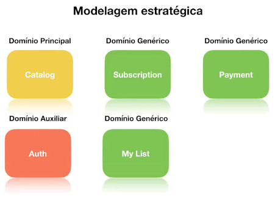
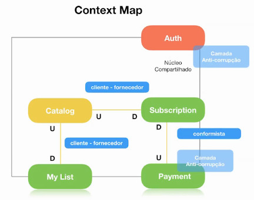
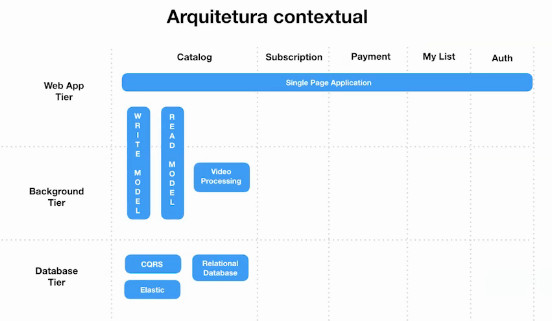
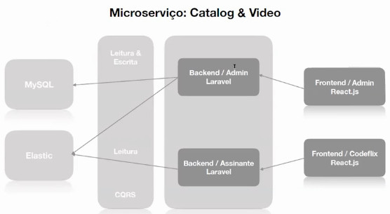
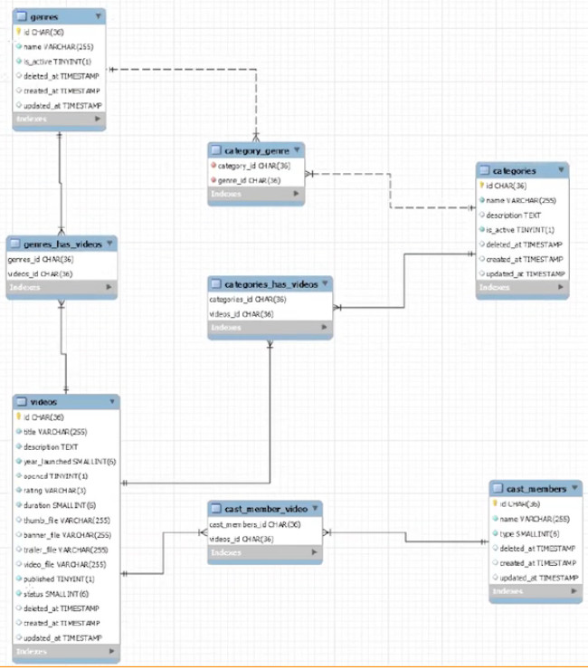

# Full Cycle Development

[Link de acesso ao treinamento](http://portal.code.education)

# Microsserviço: Catálogo de Vídeos - Introdução
---

# 1. Visão geral

## Glossário / Linguagem Ubíqua

- Catalog
  - Catálogo de vídeos  
- Category
  - Define o tipo de categorização de um vídeo (Ex.: filme, documentário, infantil)
- Genre
  - Define o gênero do vídeo (ex.: terror, comédia, ação)
- Cast members
  - atores, diretores e outras pessoas responsáveis pela criação do vídeo
- Featured Video
  - Vídeo em destaque na plataforma
- My Videos
  - Lista de vídeos favoritos indicados explicitamente pelo usuário. Normalmente essa função tem o objetivo do usuário assistir ao vídeo depois
- Subscription
  - Assinatura que o cliente realiza no sistema para acessar a plataforma
- Plan
  - Plano que o usuário poderá contratar em uma assinatura para acessar a plataforma
- Client
  - Cliente que contrata o acesso na plataforma de vídeos
- User
  - Qualquer pessoa que tenha acesso ao sistema, independente de permissão ou função

## Modelagem Estratégica

Cada domínio apresentado será transformado em um microsserviço.

## Context Map

## Arquitetura Contextual

# 2. Parte Prática - Apresentação

## Microsserviço: Catalog & Video

- Backend (API Rest)
  - Laravel
  - Testes automatizados
  - Processo de upload (local para testes e GCP para produção)
  - RabbitMQ para mensageria
- CQRS
  - MySQL
  - Elastic Search
- Frontend (SSA)
  - React.js com Material Design (MaterialUI)
  - SPA

## Modelo de Dasos

